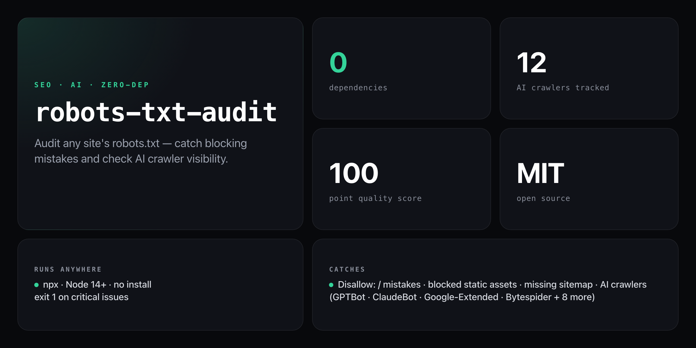

<div align="center">

**Instantly audit any site's robots.txt — catch critical mistakes before they hurt your SEO or AI discoverability.**


</div>

---

A misconfigured `robots.txt` can silently block your entire site from search engines or lock out every AI crawler — and it's invisible until your traffic tanks. `robots-txt-audit` fetches, parses, and scores any site's robots.txt in seconds, with a dedicated AI crawler visibility section that shows exactly which bots can reach your content.

```
  robots-txt-audit  by NickCirv
  ─────────────────────────────────────────
  Auditing: https://example.com/robots.txt

  Issues
  ─────────────────────────────────────────
  [ CRITICAL ] [*] has Disallow: / — blocking the ENTIRE site for this agent.
  [ WARNING  ] [*] Disallow: /assets — blocking static assets can break rendering.
  [ SUGGESTION] No Sitemap directive found — helps crawlers discover your content.

  AI Crawler Visibility
  ─────────────────────────────────────────
  ✗ GPTBot               (OpenAI)                  BLOCKED
  ✗ Google-Extended      (Google AI)               BLOCKED
  ✓ ClaudeBot            (Anthropic)               ALLOWED
  ✓ CCBot                (Common Crawl)            ALLOWED
  ✗ Bytespider           (TikTok/ByteDance)        BLOCKED
  ✓ FacebookBot          (Meta)                    ALLOWED
  ✓ PerplexityBot        (Perplexity)              ALLOWED

  Quality Score
  ─────────────────────────────────────────
  40/100  ████░░░░░░
  Critical issues found — immediate action needed.
```

## Install

No install required — runs straight from GitHub with zero dependencies:

```bash
npx github:NickCirv/robots-txt-audit https://example.com
```

## Usage

```bash
# Full audit — issues + AI crawler visibility + quality score
npx github:NickCirv/robots-txt-audit https://example.com

# AI crawlers only — skip the general issues report
npx github:NickCirv/robots-txt-audit https://example.com --ai
```

| Flag | Description |
|------|-------------|
| `<url>` | Site to audit (required) — provide the domain, not the robots.txt path |
| `--ai` | Show only the AI crawler visibility section |

## What it checks

| Check | Severity |
|-------|----------|
| `Disallow: /` — blocks entire site for an agent | CRITICAL |
| Blocking CSS / JS / static assets | WARNING |
| Blocking `/wp-admin` without `Allow: /wp-admin/admin-ajax.php` | WARNING |
| Missing `robots.txt` (HTTP 404) | WARNING |
| No `Sitemap` directive | SUGGESTION |
| Duplicate rules across blocks | CLEANUP |
| `Crawl-delay` directive present | INFO |
| Wildcard path patterns | INFO |
| Agent block with no `Disallow` rules (fully open) | INFO |

## AI crawlers tracked

| Bot | Organisation |
|-----|--------------|
| GPTBot | OpenAI |
| Google-Extended | Google AI |
| ClaudeBot / anthropic-ai | Anthropic |
| CCBot | Common Crawl |
| Bytespider | TikTok / ByteDance |
| FacebookBot | Meta |
| PerplexityBot | Perplexity |
| YouBot | You.com |
| Applebot-Extended | Apple AI |
| Omgili / omgilibot | Webz.io |
| DiffBot | DiffBot |
| Amazonbot | Amazon Alexa |

## Scoring

| Score | Meaning |
|-------|---------|
| 80–100 | Good — minor improvements possible |
| 50–79 | Needs attention — review warnings |
| 0–49 | Critical issues — act now |

Scoring deducts points per finding: CRITICAL −30, WARNING −10, CLEANUP −5, SUGGESTION −5.

## What it is NOT

- **Not a crawl simulator.** It parses directive syntax and checks common mistake patterns — it does not simulate a full Googlebot crawl or path-level matching beyond the flagged patterns.
- **Not a fix tool.** It tells you exactly what's wrong and why; editing the `robots.txt` is up to you.
- **Not a guarantee.** Some crawlers ignore `robots.txt` entirely. This tool audits the file, not crawler behaviour.

---

<div align="center">
<sub>Zero dependencies · Node 14+ · MIT · by <a href="https://github.com/NickCirv">NickCirv</a></sub>
</div>
