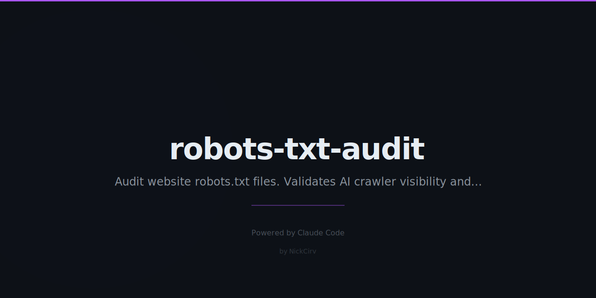

# robots-txt-audit

[](https://www.npmjs.com/package/robots-txt-audit)
[](https://opensource.org/licenses/MIT)
[](https://nodejs.org)
[](https://www.npmjs.com/package/robots-txt-audit)

```
  robots-txt-audit  by NickCirv
  ─────────────────────────────────────────
  Auditing: https://example.com/robots.txt

  Issues
  ─────────────────────────────────────────
  [ CRITICAL ] [*] has Disallow: / — blocking the ENTIRE site for this agent.
  [ WARNING  ] [*] Disallow: /assets — blocking static assets can break rendering.
  [ SUGGESTION] No Sitemap directive found — helps crawlers discover your content.

  AI Crawler Visibility
  ─────────────────────────────────────────
  ✗ GPTBot               (OpenAI)                  BLOCKED
  ✗ Google-Extended      (Google AI)               BLOCKED
  ✓ ClaudeBot            (Anthropic)               ALLOWED
  ✓ CCBot                (Common Crawl)            ALLOWED
  ✗ Bytespider           (TikTok/ByteDance)        BLOCKED
  ✓ FacebookBot          (Meta)                    ALLOWED
  ✓ PerplexityBot        (Perplexity)              ALLOWED

  Quality Score
  ─────────────────────────────────────────
  40/100  ████░░░░░░
  Critical issues found — immediate action needed.
```

Zero-dependency Node.js CLI. Parses any site's `robots.txt` and tells you what you're accidentally blocking — including AI crawlers.

## Install

```bash
npx robots-txt-audit https://example.com
```

Or install globally:

```bash
npm install -g robots-txt-audit
robots-txt-audit https://example.com
```

## Usage

```bash
# Full audit
robots-txt-audit https://example.com

# AI crawlers only
robots-txt-audit https://example.com --ai
```

## What it checks

| Check | Level |
|---|---|
| Disallow: / (blocks everything) | CRITICAL |
| Blocking CSS/JS/static assets | WARNING |
| Blocking /wp-admin without admin-ajax.php | WARNING |
| Missing robots.txt (404) | WARNING |
| No Sitemap directive | SUGGESTION |
| Duplicate rules | CLEANUP |
| Crawl-delay directive | INFO |
| Wildcard path patterns | INFO |
| No Disallow rules (fully open) | INFO |

## AI Crawlers Tracked

| Bot | Organization |
|---|---|
| GPTBot | OpenAI |
| Google-Extended | Google AI |
| ClaudeBot / anthropic-ai | Anthropic |
| CCBot | Common Crawl |
| Bytespider | TikTok / ByteDance |
| FacebookBot | Meta |
| PerplexityBot | Perplexity |
| YouBot | You.com |
| Applebot-Extended | Apple AI |
| Omgili / omgilibot | Webz.io |
| DiffBot | DiffBot |
| Amazonbot | Amazon Alexa |

## Scoring

| Score | Meaning |
|---|---|
| 80-100 | Good — minor improvements possible |
| 50-79 | Needs attention |
| 0-49 | Critical issues — act now |

## You might also like

**Cirv Lens** (coming soon) — WordPress plugin for AI discoverability. Auto-generates `llms.txt`, optimises for AI crawlers, adds structured data for AI assistant citations.

github.com/NickCirv

---

MIT License

## Contributing

PRs welcome! If you have a funny idea or improvement:

1. Fork the repo
2. Create your feature branch (`git checkout -b feature/amazing-idea`)
3. Commit your changes
4. Push to the branch (`git push origin feature/amazing-idea`)
5. Open a Pull Request

Found a bug? [Open an issue](https://github.com/NickCirv/robots-txt-audit/issues).

---

If this made you mass-exhale through your nose, mass-hit that star button.
